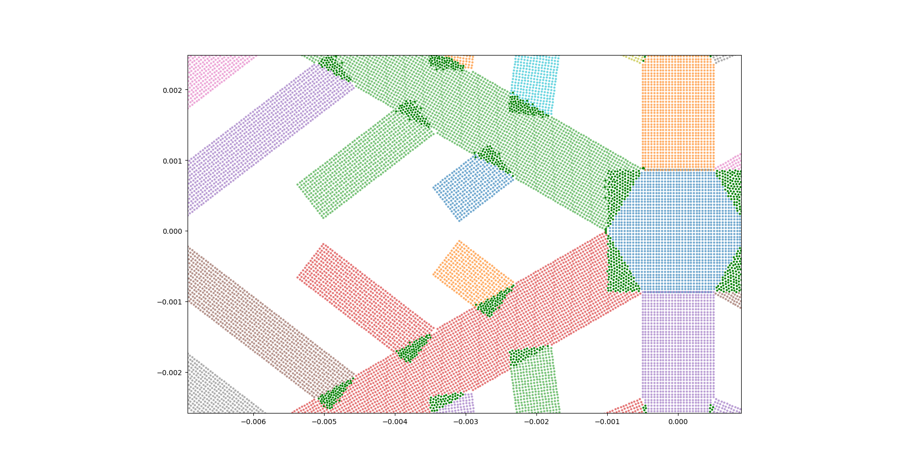

# Dendrite ❄️

By Noah Marquie as part of the UBC Mathematics Anthony Wachs Research Group.


2D and 3D point-cloud generation for complex meshes using physics-informed particle simulations. 

## Overview

This repository is a package to create 2D point clouds to fill in arbitrary polygons using physics-informed particle simulations. Additionally, this package includes 'extrude' functionality to extend point clouds in 3D.



## Installation and Usage

Use the following two commands to install Dendrite.

```
git clone https://github.com/noahmarquie1/dendrite.git
pip install -e .
```

To generate a mesh, use the following command.

```
dendrite gen --static-poly {PATH} --dynamic-poly {PATH} --anim --csv --png --extrude --out-dir {PATH}
```


## Tech Stack

- Language: Python 3.12
- Key Libraries: SciPy, JAX, NumPy, Matplotlib, Shapely
- Tools: Git Version Control (GitHub)

